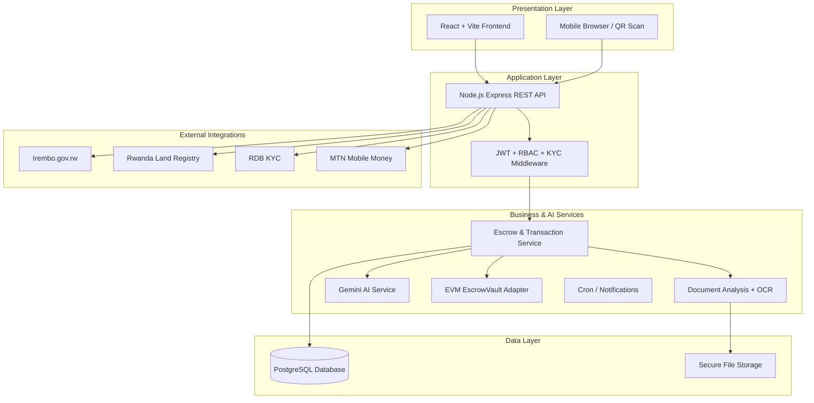
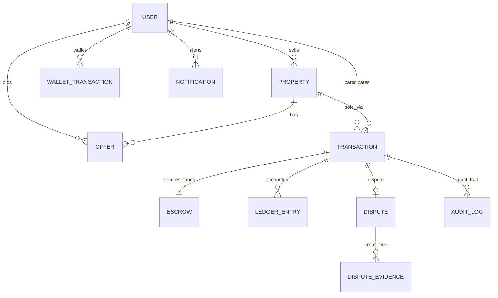
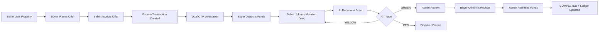
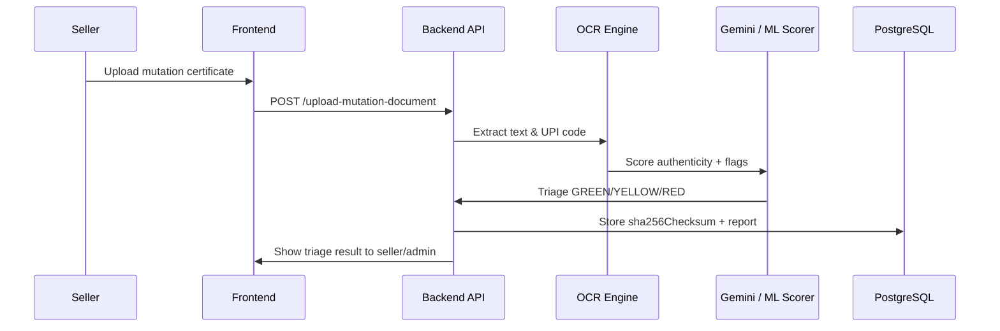
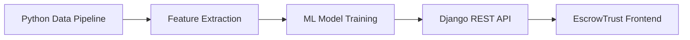

# EscrowTrust Platform — PowerPoint Presentation Content

> **Student / Developer:** Jospin Nabonyimana  
> **Project:** Real Estate Escrow & Automated Deed Management System (Rwanda)  
> **Purpose:** Training presentation outline (Python, Django + ML track)  
> **Use:** Copy each section into PowerPoint slides. Diagrams render in GitHub, VS Code, or [mermaid.live](https://mermaid.live).

---

## Slide 1 — Title Slide

**EscrowTrust**  
*Secure Real Estate Escrow & AI-Powered Deed Verification Platform*

- **Presenter:** Jospin Nabonyimana  
- **Institution / Training Program:** [Your school name]  
- **Course Focus:** Python · Django · Machine Learning  
- **Date:** August 2026  

**Tagline:** *Protecting buyers, sellers, and land records through smart escrow, AI document analysis, and auditable finance.*

---

## Slide 2 — Background & Context

Real estate is one of the highest-value transactions ordinary citizens make. In Rwanda and across Africa, digital land systems (UPI codes, Irembo, RLMA) are improving — but **trust gaps remain** between payment and title transfer.

**Current pain points in the market:**

| Problem | Impact |
|---------|--------|
| Buyers pay sellers directly before deed confirmation | High fraud risk, no refund guarantee |
| Fake or edited land title documents | Sellers deceive buyers with Photoshop certificates |
| Manual, slow admin review | Delays closings; human bottlenecks |
| No unified audit trail | Disputes are hard to resolve with evidence |
| Lack of financial transparency | Buyers/sellers cannot see where money moved |

---

## Slide 3 — Problem Statement

> **How can we build a digital platform that holds buyer funds safely in escrow, verifies land deed authenticity using AI, and releases payment only when legal conditions are met — while giving every party a clear, auditable record of the transaction?**

**Stakeholders affected:**

- **Buyers** — fear losing money before receiving valid title  
- **Sellers** — fear non-payment or false disputes  
- **Land administrators** — overwhelmed by manual document checks  
- **Platform operators** — need revenue, compliance, and dispute tools  

**Scope:** Residential & commercial property transactions within Rwanda's land ecosystem (UPI, mutation certificates, institutional KYC).

---

## Slide 4 — Project Objectives

### General Objective
Design and implement a web-based escrow management system that secures property transactions from offer to deed completion.

### Specific Objectives

1. Enable **buyers and sellers** to list, browse, bid, and close deals securely  
2. Lock funds in an **escrow vault** until mutation documents are verified  
3. Use **AI/ML** to scan uploaded deeds and classify risk (Green / Yellow / Red)  
4. Provide **double-entry accounting journals** for financial audit  
5. Offer **dispute resolution** with evidence upload and admin mediation  
6. Generate **tamper-evident audit logs** linked in a hash chain  
7. Allow **public contract verification** via QR code and SHA-256 checksum  

---

## Slide 5 — Proposed Solution (Our Response)

**EscrowTrust** is a full-stack escrow platform that combines:

```
┌─────────────────────┐    ┌──────────────────────┐    ┌─────────────────────────┐
│  REALTOR MARKETPLACE │    │   ESCROW SMART VAULT  │    │  AI + INSTITUTION HOOKS │
│  List · Bid · Buy    │───▶│  Lock · Verify · Pay  │───▶│  OCR · Gemini · Irembo  │
└─────────────────────┘    └──────────────────────┘    └─────────────────────────┘
```

**Core idea:** Money never goes directly to the seller until:
- Buyer deposits into escrow  
- Seller uploads mutation / deed documents  
- AI + admin verify authenticity  
- Both parties confirm (OTP consensus)  
- Admin releases funds to seller wallet  

**Result:** Reduced fraud, faster triage, transparent accounting, and verifiable contracts.

---

## Slide 6 — Target Users & Roles

| Role | Responsibilities |
|------|------------------|
| **Buyer** | Browse properties, place offers, deposit escrow, confirm receipt, raise disputes |
| **Seller** | List properties, accept offers, upload mutation docs, receive payout |
| **Admin** | KYC review, registry verification, release/refund, dispute mediation, audit |

**Access control:** Role-based permissions (RBAC) with JWT authentication and KYC gates for financial actions.

---

## Slide 7 — Key Features (What the System Does)

### Marketplace
- Property catalog (fixed price & auction/bidding)  
- Offers with AI buyer ranking (price, payment period, KYC bonus)  
- Auto-hide listings when active bids exist  

### Escrow Workflow
- Transaction state machine: `PENDING → FUNDED → MUTATION → UNDER_REVIEW → COMPLETED`  
- Dual OTP verification (buyer + seller consensus)  
- EVM-style smart contract address per deal  

### Document & AI
- SHA-256 fingerprint on every uploaded deed  
- OCR + rules engine + Gemini AI triage  
- Highlight contract text → **Ask AI to Explain** (plain-language legal summary)  

### Finance & Audit
- Per-deal + platform-wide double-entry ledger  
- Seller wallet credits & withdrawal requests  
- Append-only audit log with blockchain-style hash chain  

### Trust & Verification
- Stamped contract preview with scannable QR code  
- Public verification portal (`/verify-contract/:checksum`)  

---

## Slide 8 — Innovations & Differentiators

| Innovation | Why it matters |
|------------|----------------|
| **AI Document Triage Pipeline** | Green / Yellow / Red classification speeds honest deals, freezes suspicious ones |
| **SHA-256 Deed Fingerprinting** | Detects tampering; checksum stored on-chain and in DB |
| **Dual OTP Consensus** | Both parties must authorize before release or refund |
| **AI Contract Explainer** | Users highlight legal text → Gemini explains in plain English |
| **Scannable QR Verification** | Anyone can verify a contract's authenticity via phone camera |
| **Global Accounting Journal** | All ledger entries across deals in one audit view |
| **Hash-Linked Audit Trail** | Logs cannot be edited — integrity verifiable like a mini-blockchain |
| **Institutional Integration Sockets** | Ready for Irembo, RLMA, RDB KYC, Mobile Money webhooks |

---

## Slide 9 — Machine Learning & AI Components

> *Aligned with Django + ML training — these are the intelligent parts of the project.*

| Component | Technique | Input | Output |
|-----------|-----------|-------|--------|
| **Document Authenticity Scanner** | OCR (Tesseract) + rule engine + scoring | Uploaded PDF/image deed | Confidence score, fraud flags, UPI extraction |
| **Triage Classifier** | Threshold-based + future ML model | Scanner score & flags | GREEN / YELLOW / RED category |
| **Buyer Offer Ranking** | Weighted scoring algorithm | Offer price, days, KYC status | Rank #1 recommendation for seller |
| **Contract Clause Explainer** | Google Gemini (NLP) | Highlighted contract text | Plain-language legal interpretation |
| **AI Chat Co-Pilot** | Gemini generative AI | User question + deal context | Context-aware platform help |
| **Property Description Generator** | Gemini generative AI | Property attributes | Marketing listing text |

### Future ML Upgrades (Python track)

```python
# Planned Django + scikit-learn / TensorFlow pipeline
# Train on labeled deed images: AUTHENTIC vs FORGED
features = [ocr_confidence, font_variance, metadata_mismatch, upi_match_score]
label = model.predict(features)  # 0 = authentic, 1 = suspicious
```

---

## Slide 10 — System Architecture



---

## Slide 11 — Technology Stack

### Current Implementation (Built & Working)

| Layer | Technology |
|-------|------------|
| Frontend | React 19, Vite, TailwindCSS, React Router |
| Backend | Node.js, Express.js, Sequelize ORM |
| Database | PostgreSQL (SQLite in dev) |
| Auth | JWT, bcrypt, role middleware |
| Blockchain | Solidity EscrowVault, Ethers.js, Hardhat |
| AI / ML | Tesseract OCR, PDF-Parse, Google Gemini API |
| Testing | Jest (54+ backend tests passing) |
| DevOps | Docker Compose, Nginx |

### Future Stack (Python + Django Training Path)

| Layer | Planned Technology |
|-------|-------------------|
| Backend API | **Django REST Framework** |
| ML Pipeline | **Python**, scikit-learn, pandas, OpenCV |
| Deep Learning | TensorFlow / PyTorch for document forgery detection |
| Task Queue | Celery + Redis for async OCR jobs |
| Admin Panel | Django Admin for institutional reviewers |

---

## Slide 12 — Entity Relationship Diagram (ERD)

> **Full database design — 11 core entities, all relationships with cardinality.**

```mermaid
erDiagram
    USER {
        int id PK
        string name
        string email UK
        string password
        enum role "BUYER|SELLER|ADMIN"
        string phone
        string address
        boolean isKycVerified
        datetime kycVerifiedAt
        decimal walletBalance
        text bio
        string kycDocumentUrl
        datetime createdAt
        datetime updatedAt
    }

    PROPERTY {
        int id PK
        int sellerId FK
        string title
        text description
        decimal price
        string location
        int bedrooms
        int bathrooms
        decimal area
        enum propertyType "APARTMENT|HOUSE|VILLA|COMMERCIAL|LAND"
        array images
        enum status "AVAILABLE|PENDING|SOLD"
        enum listingType "FIXED_PRICE|AUCTION"
        datetime biddingDeadline
        string upiCode
        datetime createdAt
        datetime updatedAt
    }

    OFFER {
        int id PK
        int propertyId FK
        int buyerId FK
        decimal price
        int paymentPeriodDays
        enum status "PENDING|ACCEPTED|REJECTED"
        datetime createdAt
        datetime updatedAt
    }

    TRANSACTION {
        int id PK
        string transactionId UK
        int propertyId FK
        int buyerId FK
        int sellerId FK
        decimal amount
        decimal buyerFee
        decimal sellerFee
        int escrowAccountId FK
        enum status "PENDING|FUNDED|MUTATION_STARTED|UNDER_REVIEW|DISPUTED|AWAITING_RECEIPT|COMPLETED|REFUNDED|CANCELLED"
        boolean buyerAuthorized
        boolean sellerAuthorized
        jsonb mutationDocuments
        jsonb registryValidationReport
        jsonb documentAnalysisReport
        text buyerSignature
        text sellerSignature
        string contractDocumentUrl
        datetime depositDate
        datetime releaseDate
        datetime createdAt
        datetime updatedAt
    }

    ESCROW {
        int id PK
        int transactionId FK UK
        string accountNumber UK
        decimal balance
        string currency
        enum status "ACTIVE|RELEASED|REFUNDED|CLOSED"
        string contractAddress
        jsonb depositHistory
        jsonb releaseHistory
        datetime createdAt
        datetime updatedAt
    }

    LEDGER_ENTRY {
        int id PK
        int transactionId FK
        int escrowAccountId FK
        enum type "DEBIT|CREDIT"
        decimal amount
        enum accountType "BUYER_CASH|SELLER_CASH|PLATFORM_REVENUE|ESCROW_CUSTODY"
        string description
        datetime createdAt
        datetime updatedAt
    }

    DISPUTE {
        int id PK
        int transactionId FK
        int initiatorId FK
        int mediatorId FK
        text reason
        enum mediatorDecision "RELEASE_TO_SELLER|REFUND_TO_BUYER|PENDING"
        text mediatorNotes
        enum status "OPEN|EVIDENCE_SUBMITTED|UNDER_MEDIATION|RESOLVED"
        datetime resolutionDeadline
        datetime createdAt
        datetime updatedAt
    }

    DISPUTE_EVIDENCE {
        int id PK
        int disputeId FK
        int uploaderId FK
        text fileUrl
        string description
        datetime createdAt
        datetime updatedAt
    }

    AUDIT_LOG {
        int id PK
        int transactionId FK
        int userId FK
        string userName
        string userRole
        string action
        datetime timestamp
        string hash
        string signature
        string previousHash
        string ipAddress
        text userAgent
        datetime createdAt
        datetime updatedAt
    }

    NOTIFICATION {
        int id PK
        int userId FK
        string title
        text message
        boolean read
        datetime createdAt
        datetime updatedAt
    }

    WALLET_TRANSACTION {
        int id PK
        int userId FK
        enum type "CREDIT|WITHDRAWAL_REQUEST|WITHDRAWAL_PAID"
        decimal amount
        string currency
        string reference
        text notes
        enum status "COMPLETED|PENDING|REJECTED"
        datetime createdAt
        datetime updatedAt
    }

    %% --- Relationships ---

    USER ||--o{ PROPERTY : "lists (sellerId)"
    USER ||--o{ OFFER : "places (buyerId)"
    USER ||--o{ TRANSACTION : "buys (buyerId)"
    USER ||--o{ TRANSACTION : "sells (sellerId)"
    USER ||--o{ DISPUTE : "initiates (initiatorId)"
    USER ||--o{ DISPUTE : "mediates (mediatorId)"
    USER ||--o{ DISPUTE_EVIDENCE : "uploads (uploaderId)"
    USER ||--o{ NOTIFICATION : "receives (userId)"
    USER ||--o{ WALLET_TRANSACTION : "owns (userId)"
    USER ||--o{ AUDIT_LOG : "performs (userId)"

    PROPERTY ||--o{ OFFER : "receives"
    PROPERTY ||--o{ TRANSACTION : "linked to"

    TRANSACTION ||--|| ESCROW : "has one vault"
    TRANSACTION ||--o{ LEDGER_ENTRY : "generates"
    TRANSACTION ||--o| DISPUTE : "may have"
    TRANSACTION ||--o{ AUDIT_LOG : "logged in"

    ESCROW ||--o{ LEDGER_ENTRY : "custody entries"

    DISPUTE ||--o{ DISPUTE_EVIDENCE : "contains"
```

---

## Slide 13 — Simplified ERD (For PPT — Easy to Read)

Use this cleaner diagram if the full ERD is too dense on one slide:



**Legend for presentation:**
- `||--||` = exactly one  
- `||--o{` = one to many  
- `||--o|` = one to zero or one  

---

## Slide 14 — Transaction Workflow (Process Flow)



---

## Slide 15 — Use Case Diagram

```mermaid
flowchart TB
    Buyer((Buyer))
    Seller((Seller))
    Admin((Admin))
    Public((Public User))

    Buyer --> UC1[Browse & Bid on Properties]
    Buyer --> UC2[Deposit Escrow Funds]
    Buyer --> UC3[Confirm Property Receipt]
    Buyer --> UC4[Ask AI to Explain Contract]
    Buyer --> UC5[Raise Dispute]

    Seller --> UC6[List & Manage Properties]
    Seller --> UC7[Accept / Reject Offers]
    Seller --> UC8[Upload Mutation Documents]
    Seller --> UC9[Withdraw Wallet Balance]

    Admin --> UC10[Verify KYC & Registry]
    Admin --> UC11[Release or Refund Escrow]
    Admin --> UC12[Mediate Disputes]
    Admin --> UC13[View Global Audit Logs]

    Public --> UC14[Scan QR & Verify Contract]
```



---

## Slide 16 — Data Flow: AI Document Verification



---

## Slide 17 — Security & Compliance Measures

| Measure | Implementation |
|---------|----------------|
| Authentication | JWT tokens, bcrypt password hashing |
| Authorization | Role-based access (Buyer / Seller / Admin) |
| KYC Gate | Identity verification before financial actions |
| Rate Limiting | API throttling against abuse |
| Secure Files | Authenticated document viewing (no public URLs) |
| OTP Consensus | Hashed verification codes with expiry & lockout |
| Audit Integrity | Append-only logs with SHA-256 hash chain |
| Document Integrity | SHA-256 checksum per uploaded deed |
| HTTPS Ready | Production deployment behind Nginx + TLS |

---

## Slide 18 — Expected Outcomes & Impact

### For Users
- Safer property purchases with escrow protection  
- Plain-language AI help understanding contracts  
- Instant QR verification of deed authenticity  

### For the Platform
- 2.5% service fee revenue (1% buyer + 1.5% seller)  
- Reduced manual review via AI triage  
- Full financial audit trail for regulators  

### For Society (Rwanda)
- Supports digital land governance goals  
- Reduces deed fraud and payment scams  
- Builds trust in online real estate marketplaces  

---

## Slide 19 — Project Status & Demo

| Milestone | Status |
|-----------|--------|
| User auth & roles | Done |
| Property marketplace & offers | Done |
| Escrow deposit / release / refund | Done |
| AI document triage | Done |
| Contract preview + QR + AI explainer | Done |
| Public verification portal | Done |
| Per-deal + global accounting journal | Done |
| Dispute module | Done |
| Backend tests | 54 passing |
| Frontend production build | Passing |

**Demo URL (local):** `http://localhost:3000`  
**Demo accounts:** `buyer@escrowtrust.com` / `seller@escrowtrust.com` / `admin@escrowtrust.com`

---

## Slide 20 — Future Work (Python + Django + ML Roadmap)

Since our training covers **Python, Django, and Machine Learning**, the next phase of EscrowTrust includes:

1. **Rebuild API with Django REST Framework** — models map 1:1 to current ERD  
2. **Celery workers** — async OCR and ML inference on uploaded deeds  
3. **Train forgery detection model** — CNN on land certificate images (authentic vs edited)  
4. **NLP pipeline** — spaCy or transformers for Kinyarwanda/English deed parsing  
5. **Recommendation engine** — collaborative filtering for property suggestions  
6. **Django Admin dashboard** — for RLMA / institutional reviewers  
7. **Model monitoring** — track triage accuracy and retrain on new fraud patterns  



---

## Slide 21 — Challenges & Mitigation

| Challenge | Mitigation |
|-----------|------------|
| Fake land documents | AI triage + SHA-256 + admin review |
| Users don't understand legal terms | Highlight & Ask AI explainer |
| Payment disputes | Escrow lock + dispute module + admin mediation |
| System downtime | Docker deployment + database backups |
| ML false positives | Human-in-the-loop admin review for RED flags |
| Integration with government APIs | Institutional webhook sockets (Irembo, RLMA) |

---

## Slide 22 — Conclusion

**EscrowTrust** addresses real financial and legal risks in Rwanda's property market by combining:

- Secure **escrow fund custody**  
- **AI-powered** document verification  
- **Transparent** double-entry accounting  
- **Tamper-evident** audit trails  
- **Public** QR-based contract verification  

The project demonstrates practical application of **web development, databases, AI/ML, and security** — and aligns naturally with our **Python + Django + ML** training for future enhancement.

> *"Trust is not built by promises — it is built by systems that verify, record, and protect every step of the deal."*

---

## Slide 23 — References & Repository

- **GitHub:** [github.com/nabonyimanajospin/escrow-account-manager](https://github.com/nabonyimanajospin/escrow-account-manager)  
- **Developer:** Jospin Nabonyimana — jospinnabonyimana@gmail.com  
- **Rwanda Land Management:** RLMA / UPI land parcel system  
- **E-Government:** Irembo.gov.rw  
- **Technologies:** React, Node.js, PostgreSQL, Gemini AI, Solidity, Docker  

---

## Appendix A — Suggested PPT Slide Order (Quick Checklist)

| # | Slide Title |
|---|-------------|
| 1 | Title |
| 2 | Background & Context |
| 3 | Problem Statement |
| 4 | Objectives |
| 5 | Proposed Solution |
| 6 | Users & Roles |
| 7 | Key Features |
| 8 | Innovations |
| 9 | ML & AI Components |
| 10 | System Architecture |
| 11 | Technology Stack |
| 12 | **ERD (Full)** |
| 13 | ERD (Simplified) — optional |
| 14 | Workflow Diagram |
| 15 | Use Cases |
| 16 | AI Data Flow |
| 17 | Security |
| 18 | Expected Impact |
| 19 | Demo / Status |
| 20 | Future (Django + ML) |
| 21 | Challenges |
| 22 | Conclusion |
| 23 | Q&A / References |

---

## Appendix B — Speaker Notes (Short)

**Opening (30 sec):**  
"Real estate fraud happens when money moves before the deed is proven. EscrowTrust solves this with a digital escrow vault, AI document scanning, and a full audit trail."

**Problem (45 sec):**  
"Mention three risks: direct payment fraud, fake certificates, and no financial transparency."

**ERD (60 sec):**  
"Eleven tables. USER connects to properties, offers, and transactions. Each transaction has one escrow account, many ledger entries, optional dispute, and immutable audit logs."

**Innovation (45 sec):**  
"Highlight QR verification and AI contract explainer — these are live demo features."

**ML slide (45 sec):**  
"Today we use OCR + Gemini. In our Python training we will train a proper forgery classifier with scikit-learn or TensorFlow."

**Closing (20 sec):**  
"EscrowTrust is built, tested, and demo-ready. The next step is migrating ML pipelines to Django and Python."

---

## Appendix C — How to Export ERD as Image for PowerPoint

1. Open [https://mermaid.live](https://mermaid.live)  
2. Paste the ERD code from **Slide 12** or **Slide 13**  
3. Click **Export → PNG / SVG**  
4. Insert image into PowerPoint slide  
5. Use **Slide 13 (Simplified ERD)** for speaking; **Slide 12 (Full ERD)** for appendix or handout  

---

*Document generated for EscrowTrust presentation — August 2026*
